> 使用EXPLAIN关键字可以模拟优化器执行SQL语句，从而知道MySQL是如何处理你的SQL语句的。分析你的查询语句或是结构的性能瓶颈  

下面是使用 explain 的例子：

在 select 语句之前增加 explain 关键字，MySQL 会在查询上设置一个标记，执行查询时，会返回执行计划的信息，而不是执行这条SQL（如果 from  中包含子查询，仍会执行该子查询，将结果放入临时表中）

### 使用的表
```sql
DROP TABLE IF EXISTS `actor`;
CREATE TABLE `actor` (
  `id` int(11) NOT NULL,
  `name` varchar(45) DEFAULT NULL,
  `update_time` datetime DEFAULT NULL,
  PRIMARY KEY (`id`)
) ENGINE=InnoDB DEFAULT CHARSET=utf8;

INSERT INTO `actor` (`id`, `name`, `update_time`) VALUES (1,'a','2017-12-22 15:27:18'), (2,'b','2017-12-22 15:27:18'), (3,'c','2017-12-22 15:27:18');

DROP TABLE IF EXISTS `film`;
CREATE TABLE `film` (
  `id` int(11) NOT NULL AUTO_INCREMENT,
  `name` varchar(10) DEFAULT NULL,
  PRIMARY KEY (`id`),
  KEY `idx_name` (`name`)
) ENGINE=InnoDB DEFAULT CHARSET=utf8;

INSERT INTO `film` (`id`, `name`) VALUES (3,'film0'),(1,'film1'),(2,'film2');

DROP TABLE IF EXISTS `film_actor`;
CREATE TABLE `film_actor` (
  `id` int(11) NOT NULL,
  `film_id` int(11) NOT NULL,
  `actor_id` int(11) NOT NULL,
  `remark` varchar(255) DEFAULT NULL,
  PRIMARY KEY (`id`),
  KEY `idx_film_actor_id` (`film_id`,`actor_id`)
) ENGINE=InnoDB DEFAULT CHARSET=utf8;

INSERT INTO `film_actor` (`id`, `film_id`, `actor_id`) VALUES (1,1,1),(2,1,2),(3,2,1); 
```
mysql> explain select * from actor;

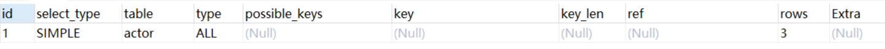

在查询中的每个表会输出一行，如果有两个表通过 join 连接查询，那么会输出两行。表的意义相当广泛：可以是子查询、一个 union 结果等。

explain 有两个变种：
- 1、**explain extended**：会在 explain  的基础上额外提供一些查询优化的信息。紧随其后通过 show warnings 命令可以 得到优化后的查询语句，从而看出优化器优化了什么。额外还有 filtered 列，是一个半分比的值，rows * filtered/100 可以估算出将要和 explain 中前一个表进行连接的行数（前一个表指 explain 中的id值比当前表id值小的表）。
  mysql> explain extended select * from film where id = 1;
  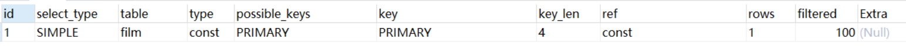
  mysql> show warnings;
  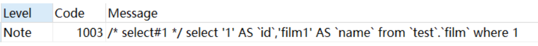
- 2、**explain partitions**：相比 explain 多了个 partitions 字段，如果查询是基于分区表的话，会显示查询将访问的分区。

### explain 中的列
接下来我们将展示 explain 中每个列的信息。

#### 1. id列
> id列的编号是 select 的序列号，有几个 select 就有几个id，并且id的顺序是按 select 出现的顺序增长的。MySQL将 select 查询分为简单查询(SIMPLE)和复杂查询(PRIMARY)。
> 复杂查询分为三类：简单子查询、派生表（from语句中的子查询）、union 查询。
> id列越大执行优先级越高，id相同则从上往下执行，id为NULL最后执行

- 简单子查询
  
  mysql> explain select (select 1 from actor limit 1) from film;
  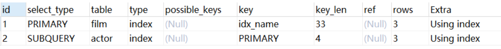
- from子句中的子查询
  
  mysql> explain select id from (select id from film) as der;
  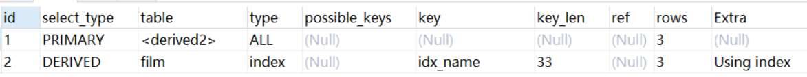
  这个查询执行时有个临时表别名为der，外部 select 查询引用了这个临时表
- union查询

  mysql> explain select 1 union all select 1;
  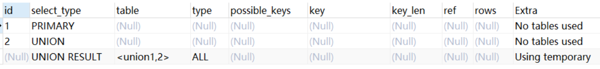
  union结果总是放在一个匿名临时表中，临时表不在SQL中出现，因此它的id是NULL。
  
#### 2. select_type列
> select_type 表示对应行是简单还是复杂的查询，如果是复杂的查询，又是上述三种复杂查询中的哪一种。

- **simple**：简单查询。查询不包含子查询和union

  mysql> explain select * from film where id = 2;
  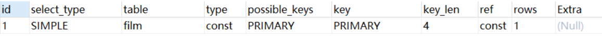
- **primary**：复杂查询中最外层的 select
- **subquery**：包含在 select 中的子查询（不在 from 子句中）
- **derived**：包含在 from 子句中的子查询。MySQL会将结果存放在一个临时表中，也称为派生表（derived的英文含义）
    
  用这个例子来了解 primary、subquery 和 derived 类型
  
  mysql> explain select (select 1 from actor where id = 1) from (select * from film where id = 1) der;
  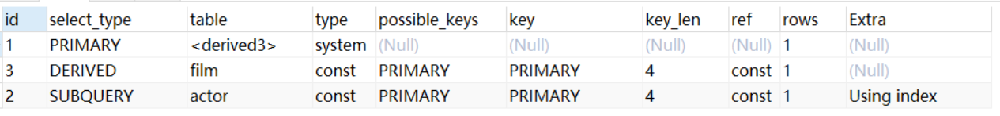
- **union**：在 union 中的第二个和随后的 select
- **union result**：从 union 临时表检索结果的 select

  用这个例子来了解 union 和 union result 类型：
  mysql> explain select 1 union all select 1;
  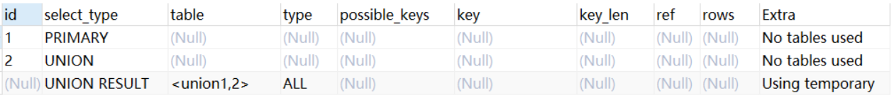
  
#### 3. table列
> 这一列表示 explain 的一行正在访问哪个表。
> 当 from 子句中有子查询时，table列是<derivenN>格式，表示当前查询依赖 id=N 的查询，于是先执行 id=N 的查询。
> 当有 union 时，UNION RESULT 的 table 列的值为<union1,2>，1和2表示参与 union 的 select 行id。

#### 4. type列
> 这一列表示关联类型或访问类型，即MySQL决定如何查找表中的行，查找数据行记录的大概范围。
> 依次从最优到最差分别为：system > const > eq_ref > ref > range > index > ALL
> 一般来说，得保证查询达到range级别，最好达到ref

- **NULL**：mysql能够在优化阶段分解查询语句，在执行阶段用不着再访问表或索引。例如：在索引列中选取最小值，可以单独查找索引来完成，不需要在执行时访问表

  mysql> explain select min(id) from film;
  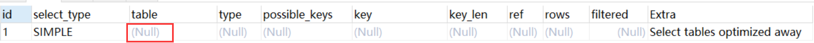
- **const, system**：mysql能对查询的某部分进行优化并将其转化成一个常量（可以看show warnings 的结果）。用于 primary key 或 unique key 的所有列与常数比较时，所以表最多有一个匹配行，读取1次，速度比较快。
- **system**是const的特例，表里只有一条元组匹配时为**system**
  
  mysql> explain extended select * from (select * from film where id = 1) tmp;
  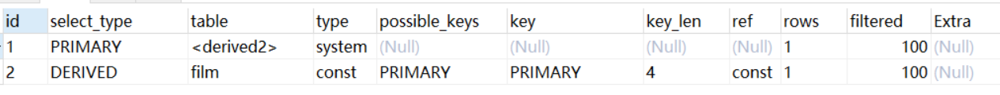
  mysql> show warnings;
  
  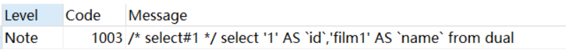
- **eq_ref**：primary key 或 unique key 索引的所有部分被连接使用 ，最多只会返回一条符合条件的记录。这可能是在 const 之外最好的联接类型了，简单的 select 查询不会出现这种 type。
  
  mysql> explain select * from film_actor left join film on film_actor.film_id = film.id;
  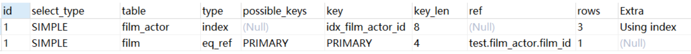
- **ref**：相比**eq_ref**，不使用唯一索引，而是使用普通索引或者唯一性索引的部分前缀，索引要和某个值相比较，可能会找到多个符合条件的行。
  1. 简单 select 查询，name是普通索引（非唯一索引） mysql> explain select * from film where name = "film1";
  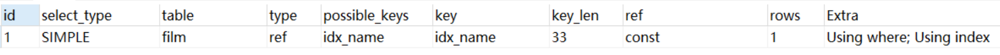
  2.关联表查询，idx_film_actor_id是film_id和actor_id的联合索引，这里使用到了film_actor的左边前缀film_id部分。 mysql> explain select film_id from film left join film_actor on film.id = film_actor.film_id;
  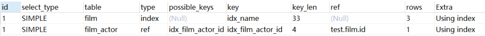
- **range**：范围扫描通常出现在 in(), between ,> ,<, >= 等操作中。使用一个索引来检索给定范围的行。
  
  mysql> explain select * from actor where id > 1;
  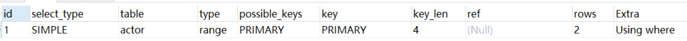
- **index**：扫描全表索引，这通常比ALL快一些。（index是从索引中读取的，而all是从硬盘中读取）
  
  mysql> explain select * from film;
  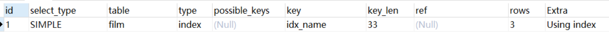
- **ALL**：即全表扫描，意味着mysql需要从头到尾去查找所需要的行。通常情况下这需要增加索引来进行优化了
  
  mysql> explain select * from actor;
  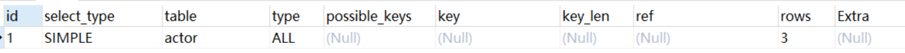
  
#### 5. possible_keys列
> 这一列显示查询可能使用哪些索引来查找。
> explain 时可能出现 possible_keys 有列，而 key 显示 NULL 的情况，这种情况是因为表中数据不多，mysql认为索引对此查询帮助不大，选择了全表查询。
> 如果该列是NULL，则没有相关的索引。在这种情况下，可以通过检查 where 子句看是否可以创造一个适当的索引来提高查询性能，然后用 explain 查看效果。

#### 6. key列
> 这一列显示mysql实际采用哪个索引来优化对该表的访问。
> 如果没有使用索引，则该列是 NULL。如果想强制mysql使用或忽视possible_keys列中的索引，在查询中使用 force index、ignore index。

#### 7. key_len列
> 这一列显示了mysql在索引里使用的字节数，通过这个值可以算出具体使用了索引中的哪些列。
> 举例来说，film_actor的联合索引 idx_film_actor_id 由 film_id 和 actor_id 两个int列组成，并且每个int是4字节。通过结果中的key_len=4可推断出查询使用了第一个列：film_id列来执行索引查找。\

mysql> explain select * from film_actor where film_id = 2;
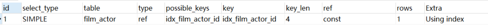
key_len计算规则如下：
- 字符串
  - char(n)：n字节长度
  - varchar(n)：2字节存储字符串长度，如果是utf-8，则长度 3n + 2
- 数值类型
  - tinyint：1字节
  - smallint：2字节
  - int：4字节
  - bigint：8字节
- 时间类型
  - date：3字节
  - timestamp：4字节
  - datetime：8字节
- 如果字段允许为 NULL，需要1字节记录是否为 NULL

索引最大长度是768字节，当字符串过长时，mysql会做一个类似左前缀索引的处理，将前半部分的字符提取出来做索引。

#### 8. ref列
[笔记](https://note.youdao.com/ynoteshare1/index.html?id=5b590cb82e7819dd439f8d0d27d2e8a7&type=note)