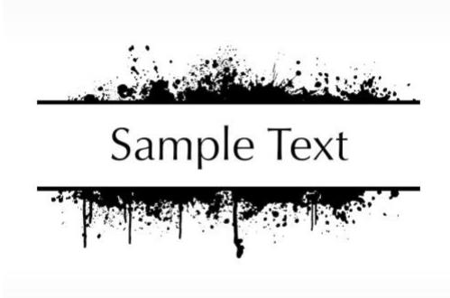
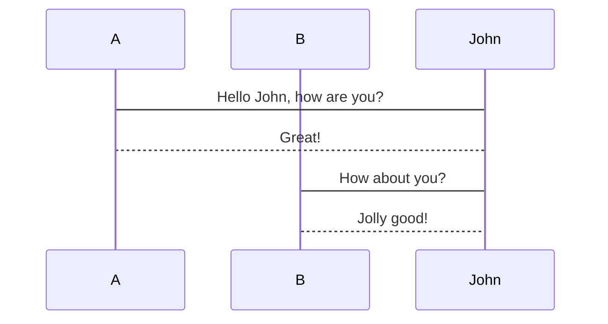
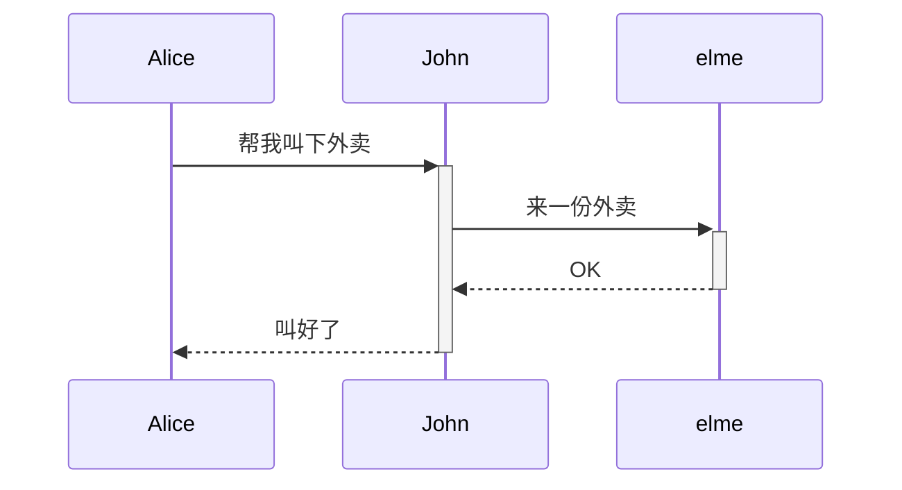
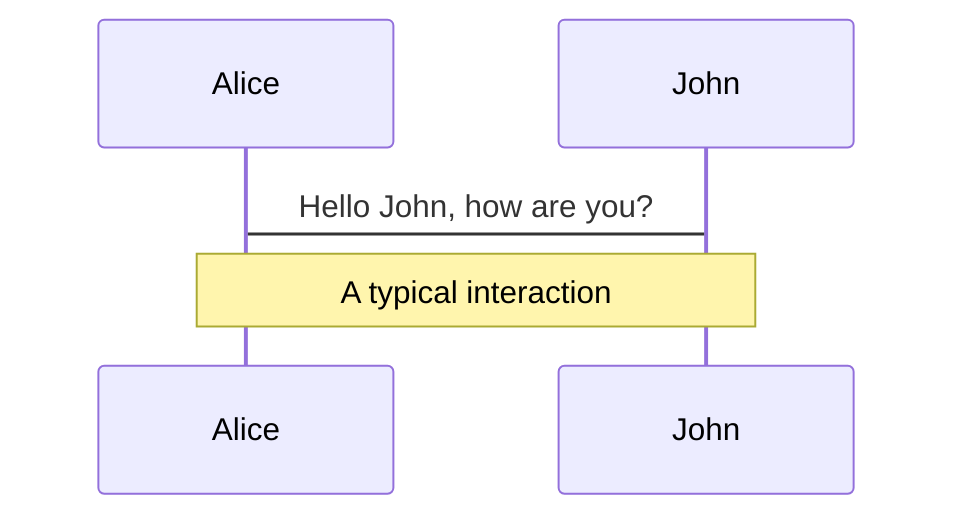
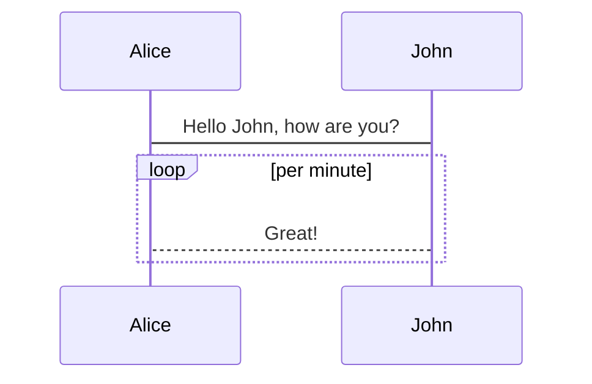
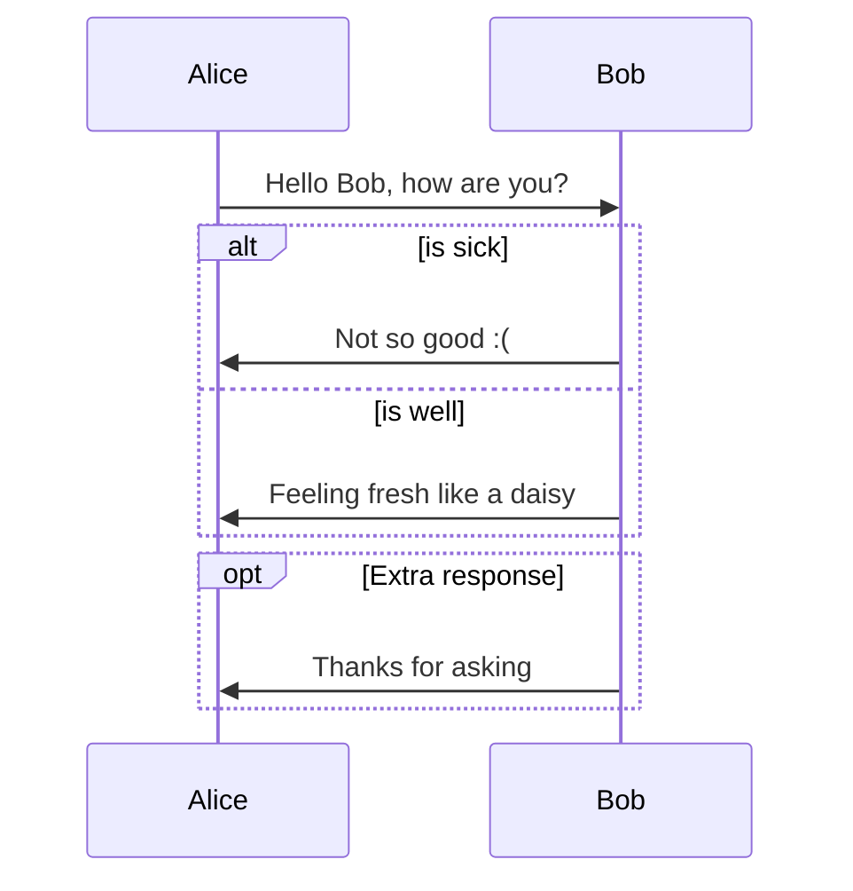
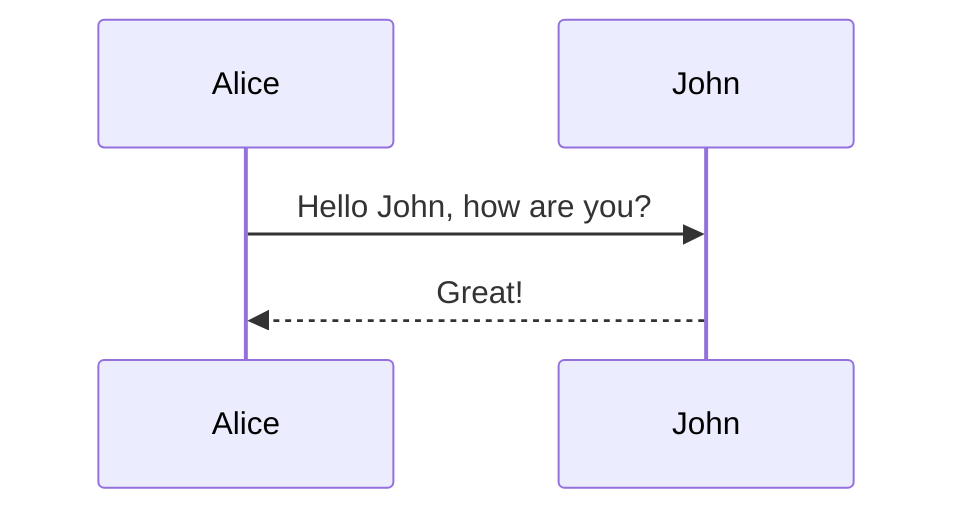
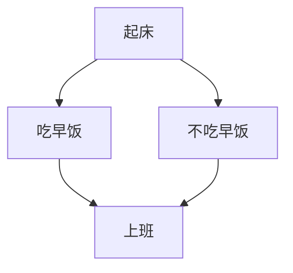
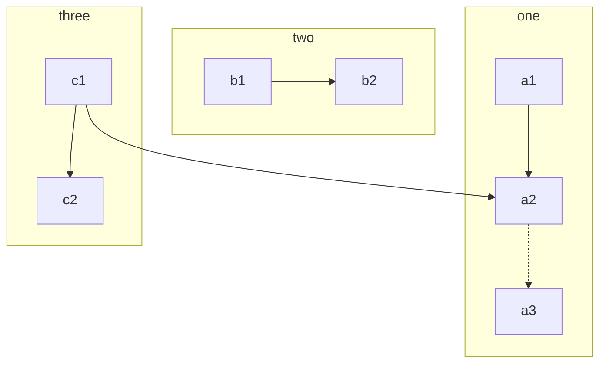
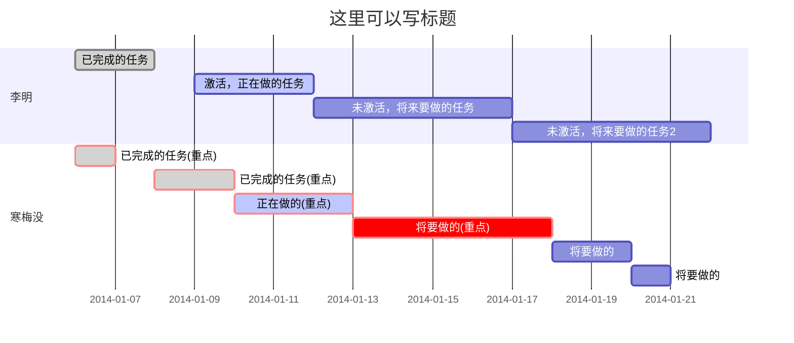

# Markdown 语法介绍 <!-- {docsify-ignore-all} -->

## 1 Markdown
> Markdown是一种具有纯文本格式语法的轻量级标记语言。它的设计使得它可以使用同名工具转换为HTML和许多其他格式。使用Markdown，可以让写作者专注于写作而不用关注样式。

支持Markdown的常用应用：
- Foxmail
- Confluence
- gitlab/github 等代码托管平台
- IntelliJ IDEA 等IDE

## 2 基本语法
### 2.1 标题
只需要在文本前面加上『# 』即可创建一级标题。同理，创建二级标题、三级标题等只需要增加『# 』个数即可，
Markdown 共支持六级标题。如下所示：
```markdown
# 一级标题
## 二级标题
### 三级标题
#### 四级标题
##### 五级标题
###### 六级标题
```
# 一级标题
## 二级标题
### 三级标题
#### 四级标题
##### 五级标题
###### 六级标题

### 2.2 强调
在Markdown中，可以使用 * 和 _ 来表示斜体和加粗。

#### 2.2.1 斜体
```markdown
*hello world*
```
*hello world*

#### 2.2.2 加粗
```markdown
**hello world**
```
**hello world**

#### 2.2.3 删除线
```markdown
~~hello world~~
```
~~hello world~~

### 2.3 引用
Markdown 标记区块只需要在整个段落的第一行最前面加上 『>』 ：
```markdown
> 这是第一级引用。 
>> 这是第二级引用。
>
> 现在回到第一级引用。
```
> 这是第一级引用。
>> 这是第二级引用。
> 
> 现在回到第一级引用。

引用的区块内也可以使用其他的 Markdown 语法，包括标题、列表、代码区块等：
```markdown
> ## 标题
> - 这是第一行列表项。
> - 这是第二行列表项。
>
> 给出一些例子代码：
>
> `return true;`
```
> ## 标题
> - 这是第一行列表项。
> - 这是第二行列表项。
>
> 给出一些例子代码：
>
> `return true;`

### 2.4 列表
#### 2.4.1 无序列表
输入`*`列表项1将创建无序列表，`*`符号可以替换为`+`或`-`：
```markdown
* 列表1
* 列表2
* 列表3
```
* 列表1
* 列表2
* 列表3

#### 2.4.2 有序列表
使用数字接着一个英文句点：
```markdown
1. Red
2. Green
3. Blue
```
1. Red
2. Green
3. Blue

### 2.5 任务列表
```markdown
- [ ] a task list item
- [ ] list syntax required
- [ ] normal **formatting**, @mentions, #1234 refs
- [ ] incomplete - [x] completed
```
- [ ] a task list item
- [ ] list syntax required
- [ ] normal **formatting**, @mentions, #1234 refs
- [ ] incomplete - [x] completed

### 2.6 代码块
#### 2.6.1 单行代码
使用 ` 将单词围住:
```markdown
`hello world`
```
`hello world`

#### 2.6.2 多行代码
使用 ``` 将代码围住
````markdown
```
public static void main(String[] args) { 
    System.out.println("hello world");
}
```
````
```
public static void main(String[] args) { 
    System.out.println("hello world");
}
```

### 2.7 表格
在 Markdown 中，可以制作表格，例如：
```markdown
First Header | Second Header | Third Header
--- | --- | ---
Content Cell | Content Cell | Content Cell
Content Cell | Content Cell | Content Cell
```
First Header | Second Header | Third Header
--- | --- | ---
Content Cell | Content Cell | Content Cell
Content Cell | Content Cell | Content Cell

或者也可以让表格两边内容对齐，中间内容居中，例如：
```markdown
First Header | Second Header | Third Header
:--- | :---: | ---:
Left | Center | Right Left | Center | Right
```
First Header | Second Header | Third Header
:--- | :---: | ---:
Left | Center | Right Left | Center | Right

### 2.8 分割线
在 Markdown 中，可以使用 3 个以上『-』符号制作分割线，例如：
```markdown
这是分隔线上部分内容
---
这是分隔线下部分内容
```
这是分隔线上部分内容
---
这是分隔线下部分内容

### 2.9 图片
```markdown

```


### 2.10 超链接
```markdown
[点击就可以百度](https://www.baidu.com/)
```
[点击就可以百度](https://www.baidu.com/)

## 3 Mermaid
> Mermaid 是一个用于画流程图、状态图、时序图、甘特图的库，使用 JS 进行本地渲染，广泛集成于许多
> 
> Markdown 编辑器中。[Mermaid GitBook](https://mermaid-js.github.io/mermaid/#/)

支持`Mermaid`语法的有:
- Typora
- gitlab
- stackedit

### 3.1 时序图
#### 3.1.1 基本语法
```markdown
[参加者][箭头][参加者]:消息
```
箭头一共有六种:

类型 | 描述
--- | ---
-> | 没有箭头的实线
--> | 没有箭头的虚线(通常用来描述响应)
->> | 有箭头的实线
-->> | 有箭头的虚线(通常用来描述请求)
-x | 有箭头的带X的实线 (通常用来表示异步)
--x | 有箭头的带X的虚线 (通常用来表示异步)

#### 3.1.2 参加者
可以通过 participant 定义参加者，参加者的顺序可以决定渲染出来的节点的顺序：
```markdown
participant 参加者A
participant 参加者B
```

#### 3.1.3 别名
可以通过 as 给参加者定义别名:
```markdown
participant A as 参加者A
participant B as 参加者B
```

#### 3.1.4 消息
用来标识参加者之间的消息，基本语法
```markdown
[参加者][箭头][参加者]:消息
```
````markdown

````


#### 3.1.5 激活
> 激活(Activation) : 代表时序图中对象执行一项操作的时期, 激活期可以理解为语义中 {} 中的内容, 表示该对象被占用以完成某个任务;

可以通过`+` `-`来增减 激活态 :
````markdown

````


#### 3.1.6 注释
可以给时序图添加注释，语法：
```
[ right of | left of | over ] [参加者]: 文本
```
````markdown

````


#### 3.1.7 循环
可以定义循环视图，语法如下：
```
loop text
... statements ...
end
```
例：
````markdown

````


#### 3.1.8 备选项
通过以下语法可以添加备选项视图：
```
alt Describing text
... statements ...
else ... statements ...
end
```
以上类似与`if` `else`结构，以下为额外选项:
```
opt Describing text
... statements ...
end
```
例:
````markdown

````


#### 3.1.9 简单示例
````markdown

````


### 3.2 流程图
#### 3.2.1 图表方向
Mermaid 支持多种图表的方向，语法如下：
```
graph 方向描述
```
方向描述:

用词 | 含义
--- | ---
TB | 从上到下
BT | 从下到上
RL | 从右到左
LR | 从左到右

#### 3.2.2 节点定义
> 流程图中每个文本块，包括开始、结束、处理、判断等。Mermaid 中每个节点都有一个 id，以及节点的文字。

节点定义:

表述 | 说明
--- | ---
`id[文字]` | 矩形节点
`id(文字)` | 圆角矩形节点
`id((文字))` | 圆形节点
`id>文字]` | 右向旗帜状节点
`id{文字}` | 菱形节点
文字内容为可选内容，如果不填，默认将id当名字

#### 3.2.3 节点间的连线
类型 | 描述
--- | ---
`---` | 无箭头的实线
`-.-` | 无箭头的虚线
`-->` | 有箭头的实线
`-.->` | 有箭头的虚线
`==>` | 有箭头的粗实线
`== text ==>` | 可插入文本的有箭头的粗实线
`-- This is the text ---`或`---\|This is the text\|` | 可以插入文本的无箭头的实线
`-->\|text\|` 或 `-- text -->` | 可以插入文本的有箭头的实线

#### 3.2.4 简单示例
````markdown

````


#### 3.2.5 子图表
语法：
```
subgraph title
    graph definition
    ...
end
```
````markdown

````


### 3.3 甘特图
> 由于甘特图实际使用比较少，而且语法相对复杂，这边只做展示，不进行具体展开
> 可以查看 [Gant diagrams](https://mermaid-js.github.io/mermaid/#/gantt) 文档获取详细操作

````markdown

````


## 4 Typora
> [Typora](https://www.typora.io/) 是一款轻便简洁的跨平台Markdown编辑器，支持即时渲染技术，这也是与其他Markdown编辑器最显著的区别。

### 4.1 时序图
> 由`js-sequence`提供支持，将代码块转换为渲染图

基本语法：
```
[参与者][箭头][参与者]:消息
```
箭头有4种：

类型 | 描述
--- | ---
-> | 实心箭头的实线(通常用来描述请求)
--> | 实心头的虚线(通常用来描述响应)
->> | 空心箭头的实线(通常用来描述异步请求)
-->> | 空心箭头的虚线(通常用来描述异步响应)

支持Note，参考[3.1.6 Notes](#_316-注释)
````markdown
```sequence
participant Bob
participant Alice
Alice->Bob: Hello Bob, how are you?
Note right of Bob: Bob thinks
Bob-->Alice: I am good thanks!
```
````
```sequence
participant Bob
participant Alice
Alice->Bob: Hello Bob, how are you?
Note right of Bob: Bob thinks
Bob-->Alice: I am good thanks!
```

### 4.2 流程图
> 由`flowchart.js`提供支持，将代码块转换为渲染图

````markdown
```flow
st=>start: Start
op=>operation: Your Operation
cond=>condition: Yes or No?
e=>end

st->op->cond
cond(yes)->e
cond(no)->op
```
````
```flow
st=>start: Start
op=>operation: Your Operation
cond=>condition: Yes or No?
e=>end

st->op->cond
cond(yes)->e
cond(no)->op
```

### 4.3 其他
- Table of Contents (TOC)
- 支持嵌入HTML直接渲染
- 便捷的表格工具
- 可以导出PDF、WORD、HTML等文件格式
- 颜值高
- [其他语法参考](https://support.typora.io/Markdown-Reference/)